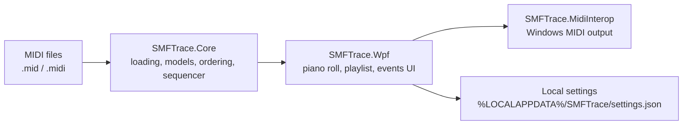

# SMF Trace


**See every event. Trust every tick.**

SMF Trace is a Windows desktop workbench for inspecting and playing Standard MIDI Files (`.mid`, `.midi`). It combines a synchronized piano roll, playlist-first playback workflow, and an event-focused diagnostics surface so you can validate exactly what a file contains and what the engine sends to a MIDI output device.

## At a Glance

| Item | Value |
| --- | --- |
| Current release | `0.9.0` |
| Targets | `net10.0`, `net10.0-windows` |
| SDK | `.NET 10.0.x` (`global.json` pins `10.0.102` and allows feature-band roll-forward) |
| Verified build | `.NET SDK 10.0.202` |
| Output root | `output/` |

## Why SMF Trace

- Loads and plays SMF Type 0 and Type 1 files.
- Shows every file event, including meta events and SysEx.
- Keeps piano roll playback and diagnostics synchronized to the same timeline.
- Rebuilds controller, bank, and program state when you seek.
- Sends SysEx by default, with a toggle to suppress output while keeping the events visible.
- Persists device choice and UI preferences between sessions.

## Version History

| Version | Status | Date | Notes |
| --- | --- | --- | --- |
| `0.9.0` | Current release | 2026-04 | .NET 10 solution, WPF desktop app, synchronized piano roll, playlist metadata, diagnostics filters, and portable `win-x64` packaging. |

## Product Features

### Playback and Timeline

- Left-to-right piano roll with a fixed playhead at 33% of the visible width.
- 30-second default view window with horizontal zoom controls.
- Vertical zoom for lane density adjustments.
- Play, pause, stop, panic, previous, next, and loop transport controls.
- Signed BPM tempo adjustment with a live effective-tempo display.
- Silent seek scrubbing while paused or stopped, followed by state rebuild on release.
- Pause sends All Notes Off; stop sends All Notes Off and resets to time 0.

### Piano Roll and Visual Analysis

- Lanes split by `(track, channel)` so multi-channel files stay readable.
- Velocity-colored note rendering with note-name and octave emphasis options.
- Toggleable bars/beats grid, note labels, piano keys, compact pitch range, and overlay mode.
- Optional lyrics lane with active-line highlighting when lyric meta events are present.
- Optional track control rail with per-track mute and solo switches.
- Custom-rendered WPF piano roll optimized for large files and smooth scrolling.

### Events Tab and Diagnostics

- Event list includes notes, control changes, program changes, meta events, SysEx, and other events.
- Category filters for Notes, CC, Program Change, Meta, SysEx, and Other.
- Meta-only mode and free-text search across event type, summary, and raw bytes.
- Details pane shows decoded event fields plus raw byte data.
- Same-tick ordering preserves Program Change before Note On for deterministic inspection.

### Playlist, Devices, and Workflow

- Replace-playlist and append-to-playlist workflows from the file picker or drag and drop.
- Double-click playlist entries to load and play immediately.
- Playlist metadata columns for duration, tempo, time signature, key, SMF type, track count, SysEx, lyrics, and path.
- MIDI output device picker with last-device restore when available.
- Default instrument selector for files that do not establish a program change before playback.
- Dark/light theme toggle and persisted UI settings.
- User settings are stored at `%LOCALAPPDATA%\SMFTrace\settings.json`.

### SysEx and Output Behavior

- SysEx messages are transmitted during playback by default.
- `No SysEx` suppresses outbound SysEx without hiding those events from the diagnostics surface.
- Panic sends All Notes Off and resets controllers for immediate recovery.

## Solution Map



| Project | Purpose |
| --- | --- |
| `src/SMFTrace.Core` | MIDI file models, file loading, event ordering, channel snapshots, and sequencer engine. |
| `src/SMFTrace.MidiInterop` | Windows MIDI device enumeration and output adapters. |
| `src/SMFTrace.Wpf` | Desktop application, piano roll control, playlist UI, events tab, and settings persistence. |
| `src/SMFTrace.Installer` | WiX installer authoring for packaged builds. |
| `tests/SMFTrace.Core.Tests` | Sequencer, ordering, loader, and state snapshot tests. |
| `tests/SMFTrace.MidiInterop.Tests` | Interop test project scaffold. |
| `tests/SMFTrace.Wpf.Tests` | Diagnostics, note pairing, and settings tests. |
| `docs/spec` | Product, technical, and branding source documents. |

## Build and Run

### Requirements

- Windows 10 or later.
- .NET SDK 10.0.x.
- PowerShell for the portable packaging script.

### Standard Developer Flow

```powershell
git clone https://github.com/thetheosopher/smf-trace.git
cd smf-trace

dotnet restore SMFTrace.slnx
dotnet build SMFTrace.slnx
dotnet test SMFTrace.slnx --no-build

dotnet run --project src/SMFTrace.Wpf/SMFTrace.Wpf.csproj -c Debug
```

### VS Code Tasks

| Task | Command |
| --- | --- |
| `build-solution` | `dotnet build SMFTrace.slnx` |
| `test-solution` | `dotnet test SMFTrace.slnx --no-build` |
| `portable-build` | `powershell -NoProfile -ExecutionPolicy Bypass -File build/portable-build.ps1` |

### Portable Package

Create a self-contained single-file Windows x64 zip:

```powershell
powershell -NoProfile -ExecutionPolicy Bypass -File build/portable-build.ps1
```

The portable build publishes `SMFTrace.exe` as a single-file app, bundles the .NET runtime and native Windows runtime dependencies into the executable, enables single-file compression, and removes non-Windows native package assets from the Windows package.

The package is written to:

- `output/portable/SMFTrace.Wpf/Release/win-x64/SMFTrace-portable-win-x64.zip`

For the default `win-x64` package, the zip contains a single file:

- `SMFTrace.exe`

### Build Outputs

| Output | Location |
| --- | --- |
| WPF app executable | `output/bin/SMFTrace.Wpf/Debug/net10.0-windows/SMFTrace.exe` |
| Portable zip | `output/portable/SMFTrace.Wpf/Release/win-x64/SMFTrace-portable-win-x64.zip` |
| Intermediate artifacts | `output/obj/<ProjectName>/<Configuration>/<TargetFramework>/...` |

## Keyboard Shortcuts

| Shortcut | Action |
| --- | --- |
| `Ctrl+O` | Replace playlist and open MIDI file(s). |
| `Ctrl+Shift+O` | Add MIDI file(s) to the current playlist. |
| `Ctrl+Shift+P` | Panic: All Notes Off plus controller reset. |
| `Ctrl+D` | Toggle dark/light theme. |
| `Ctrl+G` | Toggle bars/beats grid. |
| `Ctrl+N` | Toggle note names. |
| `Ctrl+K` | Toggle piano keys. |
| `Ctrl+Y` | Toggle lyrics lane when lyrics are available. |
| `Ctrl+T` | Toggle tempo badge. |
| `Ctrl+M` | Toggle track mute/solo panel. |
| `Ctrl+Shift+C` | Toggle compact pitch range. |
| `Ctrl+Shift+V` | Toggle overlay mode. |
| `Ctrl+Shift+X` | Toggle SysEx output suppression. |
| `Space` | Play / pause. |
| `S` | Stop. |
| `Left` / `Right` | Previous / next playlist entry. |
| `L` | Toggle loop playback. |
| `+` / `-` | Horizontal zoom in / out. |
| `Shift + +` / `Shift + -` | Vertical zoom in / out. |
| `Shift + mouse wheel` | Vertical zoom. |
| `Delete` | Remove selected entries on the Playlist tab. |

## Documentation

- [Product Specification](docs/spec/SMF_Trace_Spec_Final.md)
- [Technical Design](docs/spec/SMF_Trace_Companion_Technical_Final.md)
- [Branding and UI Copy](docs/spec/SMF_Trace_Branding_Pro_Icon_Concepts_v2.md)

---

© 2026 SMF Trace
